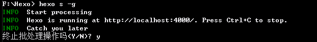
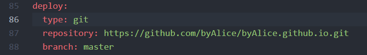
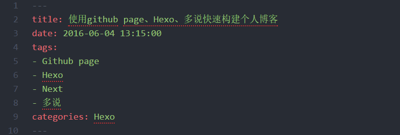
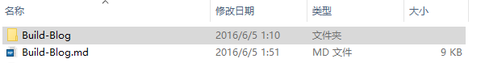
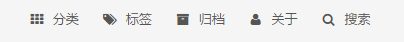
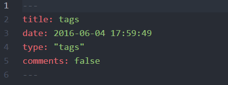

---

title: 使用github page、Hexo、多说快速构建个人博客
date: 2016-06-04 13:15:00
tags:
-   Github page
-   Hexo   Next
-   多说

categories:
- Hexo

---

> 工欲善其事，必先利其器！

## 前言

自从学习使用github后，了解到可以使用github page搭建个人博客，就一直梦想着自己有一天能够也能够搭建拥有自己的博客，记得高中时候还经常看一些美文之类的书，喜欢一些唯美的语句，甚至还曾经梦想着能做个作家，好吧，扯远了，经过这两天的摸索，终于成功构建了自己的博客！下面介绍一下搭建过程。第一次发文，有错误之处还希望大神们批评指正。  

### 搭建前提：

既然你能找到这篇博文相信你至少对github有一定了解，对于github如何注册之类在这里就不在赘述了！  

1.  使用github创建一个UserName.github.io版本库文件，UserName是你的github登录名。

2.  安装[**node.js**](https://nodejs.org/en/)

3. 安装git，或安装github客户端，自我感觉github客户端很好用，界面很友好，同样操作起来也比git好用的多！我用的是window10系统，在官网下载数次都未安装成功，最后在知乎上终于找到安装包，链接: [http://pan.baidu.com/s/1eS2mHxS](http://pan.baidu.com/s/1eS2mHxS) 密码: yatq ，有需要的同学可以点击下载。

## 安装步骤

### 安装Hexo

使用git shell,依次输入以下代码命令：

    1. cd /  
    2. npm install hexo-cli -g  

**命令解释：**

cd和/之间要有空格，这条指令的作用是返回根目录，也可以在cd /后加入一个文件名，例如下文要用到的cd /Hexo 就可以指向这个文件夹，再输入代码行就默认在在此文件下执行。

### 安装博客所需文件

    1. cd /
    2. hexo init Hexo
    3. cd /Hexo
    4. npm install
    5. hexo generate（可简写为hexo g）
    6. hexo sever（可简写为hexo s）

**命令解释: **

1.  cd /这里返回的根目录取决于你在github客户端的设置，我设置的是F盘，所以返回得也是F盘，所以下面创建的Hexo文件夹也在F盘。

2.  _Hexo_这个文件名可以随便命名，存放的是构建博客所要用到的所有文件。

3.  指向Hexo目录

4.  安装依赖文件

5.  编译

6.  开启本地服务(第5、6步的操作可以合并成hexo s -g)

此时打开浏览器，在地址栏输入[http://localhost:4000/](http://localhost:4000/)
即可查看博客的原型，是不是看到了胜利的曙光；但是如果“显示无法访问此网站”也不要沮丧，我这步是直接看到页面的，你无法访问的原因可能你没有翻墙，因为页面中默认使用了ajax.google.com 下的js包。

那么如何翻墙呢？ 下面提供我所知道的两种方法：  

*  这种方法比较简单，下载安装运行Lantern，可以官网下载的吧！这里提供一下安装包吧，链接: [http://pan.baidu.com/s/1c2x7eRu](http://pan.baidu.com/s/1c2x7eRu)
    密码: z3kw

*  这种方法需要修改hosts文件，我的 hosts 文件路径：C:\Windows\System32\drivers\etc ，详细攻略：[http://blog.my-eclipse.cn/host-google.html](http://blog.my-eclipse.cn/host-google.html)

*  如果你不想翻墙，可以采用这种方法：[http://blog.netpi.me/%E5%AE%9E%E7%94%A8/hexo/](http://blog.netpi.me/%E5%AE%9E%E7%94%A8/hexo/)

如果你想成功在[http://localhost:4000/](http://localhost:4000/)
下看到了博客原型，那么再进行一些简单的操作之后就可以马上拥有自己的博客了，是不是很激动！

> **行百里者半九十**

不到成功的那一刻，一切欣喜若狂都是不值得的！如果你已经迫不及待，我们继续：

### 部署博客到服务器

也就是把博客部署到github page提供的服务器上。

#### 步骤

*  首先回到git shell按ctrl+c，之后输入y即可，如下图所示：

*  修改Hexo文件夹下_config.yml文件，如下图所示修改，repository后的地址要改成你自己的地址：

*  继续回到git shell输入命令：

        1.  hexo clean
        2.  hexo g
        3.  hexo s
        4.  hexo d

**命令解释:**

1.  清除public，当 source 文件夹中的部分资源更改过之后，特别是对文件进行了删除或者路径的改变之后，需要执行这个命令，然后重新编译。
2.  编译，一般部署上去的时候都需要编译一下，编译后，会出现一个 public 文件夹，将所有的md文件编译成html文件
3.  开启本地服务，
4.  部署博客到github上，如果一切顺利，你就通过访问usename.github.io访问你的博客了！

**是的，现在你拥有了自己的博客！**

## 发表博文

千辛万苦建立了博客，那么我们来学习一下如何发表博文。

### 新建博文

继续回到git shell输入：

    hexo new "新博文的名字"

即可在 Hexo\source_posts 目录中找到"新博文的名字.md"这个文件。你就可以使用maekdown编辑器打开进行编写博客内容了。

### Markdown编辑器

推荐两款我所使用的markdown编辑器：

*   MIU，据说是仿mac版的mou，界面相当友好，非常喜欢，官网都下载不了，挺小众，可能我就是典型的少说派，我也是偶然间得到，在此提供下载地址：
    链接: [http://pan.baidu.com/s/1slMPeTR](http://pan.baidu.com/s/1slMPeTR)
    密码: 2pnk

*   正在使用的[Atom](http://www.iplaysoft.com/atom-editor.html):更为先进的文本代码编辑器 ,由 Github 打造的下一代编程开发神器,其中支持markdown。

#### 可能会遇到的问题

##### 标签书写格式（如果分类有多个，也要按照标签的格式来写）：

##### 优雅的在博客上插入图片

看到很多博客上说使用七牛，但是这种方法可能是用着最爽的，我们来看一下如何使用：

* 首先确认 _config.yml 中更改 post_asset_folder:true 。

* 回到git shell，输入

    `npm install https://github.com/CodeFalling/hexo-asset-image --save`

*  继续执行

    1.  hexo clean
    2.  hexo g
    3.  hexo s
    4.  hexo d

* 重新创建一个博客名字，然后发现Hexo\source\_posts下多了一个与博客名字相同的空文件夹

* 然后就可以把我们博客中要用到的图片存放在这个文件夹下，需要时直接引用即可，是不是特别方便？

##### 提醒：

写一篇博文时尽量只使用一种markdown编辑器，如果同时使用两个编辑器，我感觉不同编辑器对markdown语法的编译还是有一些差别的，用这个编辑器写好的格式用另一个编辑器打开却乱了！

### 预览和发表

继续重复以下命令即可实现预览和发表，恭喜你已经在自己建设的博客网站上发表了第一篇博文！

    1.  hexo clean
    2.  hexo g
    3.  hexo s
    4.  hexo d

#### 更高大上的发表博文的方法

使用Travis CI自动部署你的Hexo博客到Github,请参考[手把手教你使用Travis CI自动部署你的Hexo博客到Github上](http://i.woblog.cn/2016/05/04/%E6%89%8B%E6%8A%8A%E6%89%8B%E6%95%99%E4%BD%A0%E4%BD%BF%E7%94%A8Travis%20CI%E8%87%AA%E5%8A%A8%E9%83%A8%E7%BD%B2%E4%BD%A0%E7%9A%84Hexo%E5%8D%9A%E5%AE%A2%E5%88%B0Github%E4%B8%8A/#more)

## 安装主题

如果你跟我一样觉得原始的博客主题很low，想更换一个高逼格的，那我们继续往下进行：

### 选择主题

你可以在[Themes·Hexo](https://github.com/hexojs/hexo/wiki/Themes)上选择你喜欢的主题，我使用的Next主题

### 安装Next主题

参考[Next官方文档](http://theme-next.iissnan.com/getting-started.html),内容十分详尽！

#### 可能会遇到的问题

在此列举我所遇到的问题，及解决方法：

##### 构建新页面

如上图那些小图标都是一个新页面，需要手动创建，那么如何创建？

回到git shell，

    hexo new page "页面名称"

比如你要创建一个about页面，就输入hexo new page "about"

##### 正确显示各页面内容

发表博文后发现点击上面建立的页面后发现是空白页，比如，打开标签页面，发现是空白，或者提示找不到！

解决方法：以标签页为例，打开Hexo\source\tags下index.md文件，修改如下：

comments: false即关闭此页面的评论功能

type: "tags"这里的值根据你想更改的页面决定

更改过后，在重新部署到github上，你就可以点击各个页面查看，发现一切都是那么美好！

### 安装插件

**hexo支持的插件：**[Plugins | Hexo](https://hexo.io/plugins/)
想安装什么插件，按照相关README.md中介绍操作即可。

* 安装多说评论和分享插件，参考[第三方服务集成](http://theme-next.iissnan.com/third-party-services.html#swfitype)

* 安装sitemap和feed插件时，如果遇到问题，可以参考[博客搬迁记 - 从WordPress到Hexo](http://www.imys.net/20150513/wordpress-to-hexo.html#无法开启RSS和sitemap)

* 安装swiftype插件，可以参考[利用swiftype为hexo添加站内搜索](http://www.jerryfu.net/post/search-engine-for-hexo-with-swiftype-v2.html)

## 感谢

* [如何利用GitHub Pages和Hexo快速搭建个人博客](http://sunwhut.com/2015/10/30/buildBlog/)

* [hexo + github + 多说 来搭建免费博客](http://blog.netpi.me/%E5%AE%9E%E7%94%A8/hexo/)

* [利用swiftype为hexo添加站内搜索](http://www.jerryfu.net/post/search-engine-for-hexo-with-swiftype-v2.html)

* [博客搬迁记 - 从WordPress到Hexo](http://www.imys.net/20150513/wordpress-to-hexo.html#无法开启RSS和sitemap)

* [在 hexo中无痛使用本地图片](http://www.tuicool.com/articles/umEBVfI)

* [手把手教你使用Travis CI自动部署你的Hexo博客到Github上](http://i.woblog.cn/2016/05/04/%E6%89%8B%E6%8A%8A%E6%89%8B%E6%95%99%E4%BD%A0%E4%BD%BF%E7%94%A8Travis%20CI%E8%87%AA%E5%8A%A8%E9%83%A8%E7%BD%B2%E4%BD%A0%E7%9A%84Hexo%E5%8D%9A%E5%AE%A2%E5%88%B0Github%E4%B8%8A/#more)

第一次发文，博客中借鉴和总结了一些前辈的文章，对你们表示诚挚的感谢！

## 后记

准确说应该是这三天以来一直在忙着搞这个博客，昨天夜里甚至搞到三点，作为一个小白一步步建立博客，时不时遇到新问题，通过搜索，以及前辈们建立博客的经验一步步解决问题，每当解决一个问题，都会有巨大的成就感和满足感，写这篇文章也算是对自己的一个交代，我从别人的博客中学到了很多，希望这篇博文也可以帮助到你！
